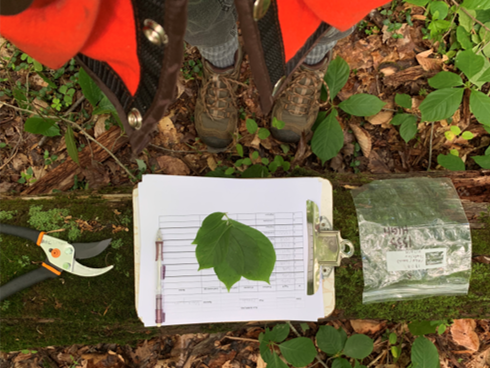

```{r setup, include=FALSE}
knitr::opts_chunk$set(echo = TRUE)
```

```{r, include=FALSE} 
## Load necessary packages
library(dplyr)
library(tidyr)
library(readr)
library(knitr)
library(ggrepel)
library(ggplot2)
```

## Motivation

Specific leaf area (SLA, the ratio of leaf area to leaf dry mass) is an important trait for plant physiological, structural, and modeling analyses. SLA is also a useful measurement to upscale plant production, vegetation community composition, and other processes in Earth System Models, providing current-day benchmarks and improving predictions of future vegetation structure and function in terrestrial ecosystems.

We investigate SLA differences between plots of varying elevation and salinity exposure along a tributary of the Chesapeake Bay. The goals of this project are to (i) quantify SLA of eight major tree species, at multiple canopy heights, in temperate deciduous forests at the Smithsonian Environmental Research Center (Maryland, USA); and (ii) test for effects of soil moisture and saltwater exposure on SLA by comparing samples taken at shoreline and upland positions, with the shoreline samples taken along a ~2 km tidal creek that provided a natural salinity gradient.

Map of SERC with plots labeled: 


## Sampling Design

I think this would be a good place for methods





### SLA Calculation

SLA is calculated using the ratio between a leaf's one-sided fresh leaf area and its total dry mass. 

```{r, echo = FALSE}
## ----- Read in the SLA csv -----
sla <- read.csv("SLA Data.csv", stringsAsFactors = FALSE) %>% 
  mutate(Tag = as.character(Tag))
```

```{r} 
sla <- sla %>% 
  mutate(specific_leaf_area = round(Leaf_Area_cm2 / Leaf_Mass_g, 3)) 
```

```{r, include = FALSE}
## ----- Join with inventory data -----

## Read in the storm surge inventory data
ss_inventory <- read.csv("ss-inventory.csv", stringsAsFactors = FALSE) %>% 
  select(Plot, Species_code, Tag, DBH) %>% 
  mutate(Tag = as.character(Tag))
summary(ss_inventory)

## The 'shore' plot at GCREW overlaps with the PREMIS-ghg HSLE plot,
## so use that inventory data too
inventory <- read.csv("inventory.csv", stringsAsFactors = FALSE) %>% 
  select(Plot, Tag, Species_code, DBH = DBH_cm_2019) %>% 
  filter(Plot == "HSLE") %>%  # GCREW only
  mutate(Plot = "Shore") %>% 
  bind_rows(ss_inventory)

# Create new dataset with plot, species, and tag columns
# by joining with the storm surge inventory data
sla %>% 
  left_join(inventory, by = "Tag") %>% 
  # if NA DBH, then get information from what we measured in field
  mutate(DBH = if_else(is.na(DBH), No_Tag_DBH, DBH),
         Species_code = if_else(is.na(Species_code), No_Tag_Species_code, Species_code),
         Plot = if_else(is.na(Plot), No_Tag_Plot, Plot)) %>% 
  # We only want four letter species codes
  mutate(Species_code = substr(Species_code, 1,4)) ->
  sla_joined
# NEW: Want ONLY ACRU, FAGR, LIST, NYSY species!
sla_joined_simple <- sla_joined %>% 
  filter(Species_code %in% c("ACRU", "FAGR", "LIST", "NYSY"))

# At this point there should be NO data with an NA for Plot or DBH or Species_code
# Warn if this occurs
if(any(is.na(sla_joined_simple$DBH))) {
  warning("We still have unmatched trees!")  
}
if(any(sla_joined_simple$Species_code == "")) {
  warning("We have blank species codes!")  
}

## Join sla_joined_simple with plot species_codes
species_codes <- read.csv(file = "Design/species_codes.csv", stringsAsFactors = FALSE) 
sla_joined_names <- left_join(sla_joined_simple, species_codes, by = "Species_code")
```

### Average Specific Leaf Area
```{r, echo = FALSE}
#SLA Box Plot
sla_averages_plot <- sla_joined_names %>% 
  ggplot(aes(Species_common, specific_leaf_area)) +
  labs(title = "Average Specific Leaf Area", x = "Species", y = "Average SLA (cm2/g)") +
  geom_boxplot(aes(fill = Species_common)) + 
  #geom_text(aes(label = round(Specific, 2)), vjust = 1.6, size = 3.3) +
  theme(axis.text.x = element_text(angle = 90)) +
  guides(fill=guide_legend(title="Species"))
print(sla_averages_plot)

sla_joined %>% 
  ggplot(aes(Species_code, specific_leaf_area, color = Position)) +
  geom_boxplot()
```

### Specific Leaf Area by Plot
```{r, echo = FALSE}
sla_by_plot <- sla_joined_names %>% 
  ggplot(aes(Species_code, specific_leaf_area)) +
  geom_jitter() +
  facet_wrap(~Plot) +
  theme(axis.text.x = element_text(angle = 90)) +
  labs(title = "Specific Leaf Area by Plot", x = "Species", y = "Specific Leaf Area")
print(sla_by_plot)
```

### Specific Leaf Area by Species
```{r, echo = FALSE}
sla_by_species <- sla_joined_names %>%
  ggplot(aes(Plot, specific_leaf_area)) +
  geom_jitter() +
  facet_wrap(~Species_common) +
  theme(axis.text.x = element_text(angle = 90)) +
  labs(title = "Specific Leaf Area by Species and Plot", y = "Specific Leaf Area (cm2/g)")
print(sla_by_species)
```

### The Relationship Between Specific Leaf Area and Tree Diameter at Breast Height
```{r, echo = FALSE}
sla_vs_dbh <- sla_joined_names %>% 
  ggplot(aes(DBH, specific_leaf_area, color = Species_common)) +
  geom_point() + 
  facet_wrap(~Species_common) +
  geom_smooth(method = "lm") +
  labs(title = "Specific Leaf Area vs. Tree Diameter", y = "Specific Leaf Area (cm2/g)", x = "Diameter at Breast Height (cm)",
       color = "Species")
print(sla_vs_dbh)
```

### 
## 