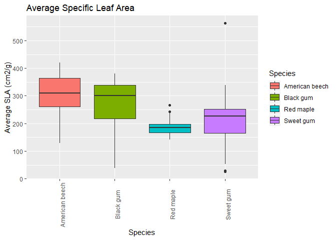
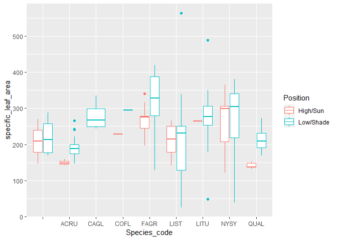
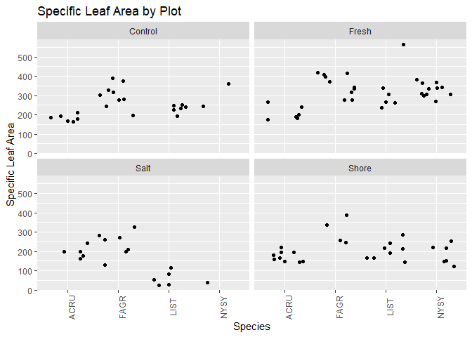
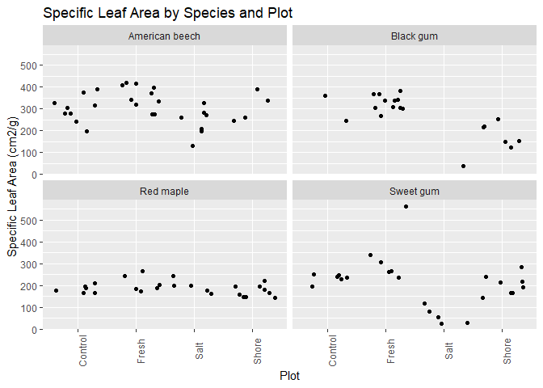
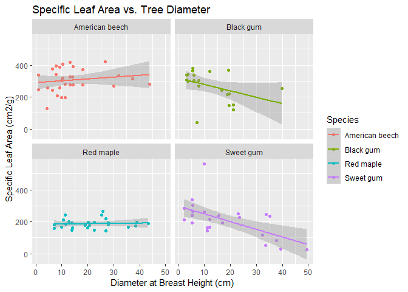

Specific leaf area in a coastal temperate deciduous forest: species and
salinity effects
================
Lillie Haddock
8/13/2019

## Motivation

Specific leaf area (SLA, the ratio of leaf area to leaf dry mass) is an
important trait for plant physiological, structural, and modeling
analyses. SLA is also a useful measurement to upscale plant production,
vegetation community composition, and other processes in Earth System
Models, providing current-day benchmarks and improving predictions of
future vegetation structure and function in terrestrial ecosystems.

We investigate SLA differences between plots of varying elevation and
salinity exposure along a tributary of the Chesapeake Bay. The goals of
this project are to (i) quantify SLA of eight major tree species, at
multiple canopy heights, in temperate deciduous forests at the
Smithsonian Environmental Research Center (Maryland, USA); and (ii) test
for effects of soil moisture and saltwater exposure on SLA by comparing
samples taken at shoreline and upland positions, with the shoreline
samples taken along a \~2 km tidal creek that provided a natural
salinity gradient.

Map of SERC with plots labeled:

## Sampling Design

I think this would be a good place for methods


### SLA Calculation

SLA is calculated using the ratio between a leaf’s one-sided fresh leaf
area and its total dry mass.

``` r
sla <- sla %>% 
  mutate(specific_leaf_area = round(Leaf_Area_cm2 / Leaf_Mass_g, 3)) 
```

### Average Specific Leaf Area

<!-- --><!-- -->

### Specific Leaf Area by Plot

<!-- -->

### Specific Leaf Area by Species

<!-- -->

### The Relationship Between Specific Leaf Area and Tree Diameter at Breast Height

<!-- -->

### 

##
