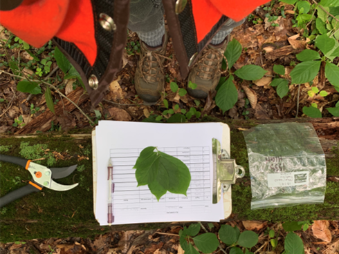
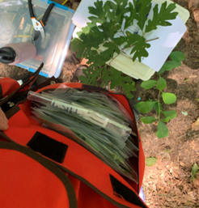

```{r setup, include=FALSE}
knitr::opts_chunk$set(echo = TRUE)
```

```{r Load Packages, include=FALSE} 
## Load necessary packages
library(dplyr)
library(tidyr)
library(readr)
library(knitr)
library(kableExtra)
library(lubridate)
library(ggrepel)
library(ggplot2)
library(gganimate)
library(cowplot)
library(wesanderson)
theme_set(theme_bw())
library(devtools)
library(nationalparkcolors)
```

## Motivation

Specific leaf area (SLA, the ratio of leaf area to leaf dry mass) is an important trait for plant physiological, structural, and modeling analyses. SLA is also a useful measurement to upscale plant production, vegetation community composition, and other processes in Earth System Models, providing current-day benchmarks and improving predictions of future vegetation structure and function in terrestrial ecosystems.

We investigate SLA differences between plots of varying elevation and salinity exposure along a tributary of the Chesapeake Bay. The goals of this project are to (i) quantify SLA of eight major tree species, at multiple canopy heights, in temperate deciduous forests at the Smithsonian Environmental Research Center (Maryland, USA); and (ii) test for effects of soil moisture and saltwater exposure on SLA by comparing samples taken at shoreline and upland positions, with the shoreline samples taken along a ~2 km tidal creek that provided a natural salinity gradient.

Map of SERC with plots labeled: 


## Methods

 

## SLA Data

SLA is calculated using the ratio between a leaf's one-sided fresh leaf area and its total dry mass. 

```{r SLA Calculation}
## ----- Read in the SLA csv -----
sla_raw <- read.csv("SLA Data.csv", stringsAsFactors = FALSE) %>% 
  mutate(Tag = as.character(Tag)) 

## ----- SLA Calculation -----
sla_calc <- sla_raw %>% 
  mutate(specific_leaf_area = round(Leaf_Area_cm2 / Leaf_Mass_g, 3)) 
```

## Inventory Data
```{r SLA Inventory, error = FALSE}
## ----- Join with inventory data -----

## Read in the storm surge inventory data 
# Storm surge inventory doesn't include the shore plot at GCREW!
ss_inventory <- read.csv("ss-inventory.csv", stringsAsFactors = FALSE) %>% 
  select(Plot, Species_code, Tag, DBH) %>% 
  mutate(Tag = as.character(Tag))

if(any(duplicated(ss_inventory$Tag))) {
  warning("We have duplicate tree tags in SS inventory!\n")
}

# Read in transplant inventory data
inventory <- read.csv("inventory.csv", stringsAsFactors = FALSE) %>% 
  select(Plot, Tag, Species_code, DBH = DBH_cm_2019, Notes) %>% 
  mutate(Tag = as.character(Tag)) 
# Check that no tag numbers are duplicated
# This is DEFENSIVE PROGRAMMING
if(any(duplicated(inventory$Tag))) {
  warning("We have duplicate tree tags in transplant inventory!\n")
  paste("Index:", which(duplicated(inventory$Tag)))
}

# Combine Storm Surge inventory with Transplant inventory
inventory <- inventory %>% 
  # Bind with storm surge inventory 
   bind_rows(ss_inventory)

# Check that no tag numbers are duplicated
# This is DEFENSIVE PROGRAMMING
if(any(duplicated(inventory$Tag))) {
  warning("We have duplicated tree tags!\n")
}

shoreline_plots <- c("Shore", "HSLE", "MSLE", "LSLE")

# Create new dataset with plot, species, and tag columns
# by joining with the storm surge inventory data

# Make blank Tag values NAs to stop duplicates when joining
sla_calc$Tag[which(sla_calc$Tag == "")] <- NA

sla_joined <- sla_calc %>% 
  left_join(inventory, by = "Tag") 

n_sla_premerge <- nrow(sla_calc)
n_sla_joined <- nrow(sla_joined)

message("Rows in sla_calc: ", n_sla_premerge)
message("Rows in sla_joined: ", n_sla_joined)
if(n_sla_joined != n_sla_premerge) {
  warning("We have a problem!\n")
}

sla_joined <- sla_joined %>% 
  # if NA DBH, then get information from what we measured in field
  mutate(DBH = if_else(is.na(DBH), No_Tag_DBH, DBH),
         Species_code = if_else(is.na(Species_code), No_Tag_Species_code, Species_code),
         Plot = if_else(is.na(Plot), No_Tag_Plot, Plot)) %>% 
  # We only want four letter species codes, and want to add an elevation column 
  mutate(Species_code = substr(Species_code, 1,4), 
         Elevation = if_else(Plot %in% shoreline_plots, "Shoreline", "Upland")) 
n_sla_joined <- nrow(sla_joined)

# At this point, everything should have a DBH entry
if(any(is.na(sla_joined$DBH))) {
warning("Missing DBH!\n") 
  paste("Tag:", sla_joined$Tag[which(is.na(sla_joined$DBH))])
}   

# NEW: Want ONLY ACRU, FAGR, LIST, NYSY, QUAL, LITU species!
sla_joined_simple <- sla_joined %>% 
  filter(Species_code %in% c("ACRU", "FAGR", "LIST", "NYSY", "QUAL", "LITU"))

# At this point there should be NO data with an NA for Plot or DBH or Species_code
# Warn if this occurs
if(any(is.na(sla_joined_simple$DBH))) {
  warning("We still have unmatched trees!\n")
  paste("Tag:", sla_joined_simple$Tag[which(is.na(sla_joined_simple$DBH))])
}
if(any(sla_joined_simple$Species_code == "")) {
  warning("We have blank species codes!")  
}

## Join sla_joined_simple with plot species_codes
species_codes <- read.csv(file = "Design/species_codes.csv", stringsAsFactors = FALSE) 
sla <- left_join(sla_joined_simple, species_codes, by = "Species_code")

# QC
n_sla_joined_simple <- nrow(sla_joined_simple)
n_sla <- nrow(sla)
message("Rows in sla_joined_simple: ", n_sla_joined_simple)
message("Rows in sla: ", n_sla)
if(n_sla_joined_simple != n_sla) {
  warning("We have a problem!\n")
}

## Adding Salinity Column 
Salinity <- c("High Salinity", "High Salinity", "Medium Salinity", "Low Salinity")
df <- data.frame(shoreline_plots, Salinity)
names(df)[names(df)=="shoreline_plots"] <- "Plot"

sla_shoreline <- sla %>% 
  filter(Plot %in% c("LSLE", "MSLE", "HSLE", "Shore")) %>% 
  left_join(df, by = "Plot")

```

### Summary Tables
```{r Summary Tables,echo= FALSE}
# SLA
# Table 1: Specific Leaf Area by Species
sla %>% 
  group_by(Species_common) %>% 
  summarise(n = n(), mean_SLA = mean(specific_leaf_area), sd_SLA = sd(specific_leaf_area)) %>% 
  knitr::kable(digits = 1, format = "html", 
               col.names = c("Species", "n", "Average SLA cm2/g", "SD"), 
               caption = "Table 1: Specific Leaf Area by Species") %>% 
  kable_styling(bootstrap_options = c("striped", "hover", "condensed", "responsive", full_width = FALSE))

# Table 2: Specific Leaf Area by Species and Plot
sla %>% 
  group_by(Species_common, Plot) %>% 
  summarise(n = n(), mean_SLA = mean(specific_leaf_area), sd_SLA = sd(specific_leaf_area)) %>% 
  knitr::kable(digits = 1, format = "html", 
               col.names = c("Species", "Plot", "n", "Average SLA cm2/g", "SD"), 
               caption = "Table 2: Specific Leaf Area by Species") %>% 
  kable_styling(bootstrap_options = c("striped", "hover", "condensed", "responsive", full_width = FALSE))

# Elevation Gradient
# Table 3: SLA Elevation Gradient
sla %>% 
  group_by(Elevation) %>% 
  summarise(n = n(), mean_SLA = mean(specific_leaf_area), sd_SLA = sd(specific_leaf_area)) %>% 
  knitr::kable(digits = 1, format = "html", 
               col.names = c("Elevation", "n", "Average SLA cm2/g", "SD"),
               caption = "Table 3: SLA Elevation Gradient") %>% 
  kable_styling(bootstrap_options = c("striped", "hover", "condensed", "responsive", full_width = FALSE))

# Canopy Position
# Table 4: SLA Canopy Position
sla %>%
  group_by(Species_common, Position) %>% 
  summarise(n = n(), mean_SLA = mean(specific_leaf_area), sd_SLA = sd(specific_leaf_area)) %>% 
  knitr::kable(digits = 1, format = "html", 
               col.names = c("Species", "Canopy Position", "n", "Average SLA cm2/g", "SD"), 
               caption = "Table 4: SLA Canopy Position") %>% 
  kable_styling(bootstrap_options = c("striped", "hover", "condensed", "responsive", full_width = FALSE))

# Salinity
# Table 5: SLA Along Salinity Gradient
sla_shoreline %>%
  group_by(Species_common, Salinity) %>% 
  summarise(n = n(), mean_SLA = mean(specific_leaf_area), sd_SLA = sd(specific_leaf_area)) %>% 
  knitr::kable(digits = 1, format = "html", 
               col.names = c("Species", "Salinity Exposure", "n", "Average SLA cm2/g", "SD"),
               caption = "Table 5: SLA Along Salinity Gradient") %>% 
  kable_styling(bootstrap_options = c("striped", "hover", "condensed", "responsive", full_width = FALSE))

sla_shoreline %>%
  group_by(Species_common, Salinity) %>% 
  summarise(mean_SLA = mean(specific_leaf_area)) %>% spread(Salinity, mean_SLA) %>% 
  knitr::kable(digits = 1, format = "html",
               col.names = c("Species", "High Salinity", "Low Salinity", "Medium Salinity"),
               caption = "Table 6: Average SLA (cm2/g) along Salinity Gradient for each Species") %>% 
  kable_styling(bootstrap_options = c("striped", "hover", "condensed", "responsive", full_width = FALSE))

sla_shoreline %>%
  group_by(Species_common, Salinity) %>% 
  summarise(mean_SLA = paste(round(mean(specific_leaf_area), digits = 2), "+/-", round(sd(specific_leaf_area), digits = 2))) %>% 
  spread(Salinity, mean_SLA) %>% 
  knitr::kable(digits = 1, format = "html",
               col.names = c("Species", "High Salinity", "Low Salinity", "Medium Salinity"),
               caption = "Table 7: Average SLA (cm2/g) along Salinity Gradient") %>% 
  kable_styling(bootstrap_options = c("striped", "hover", "condensed", "responsive", full_width = FALSE))
```


### Quality Control Plots
```{r Quality Control Plots, echo = FALSE}
## leaves vs area
leaves_vs_area <- sla %>% 
  ggplot(aes(n_Leaves, Leaf_Area_cm2, color = Species_code)) +
  geom_point() +
  facet_wrap(~Species_code, scales = "free") +
  geom_smooth(method = lm) + 
  labs(title = "Number of Leaves vs. Leaf Area")
print(leaves_vs_area)

## leaves vs mass
leaves_vs_mass <- sla %>% 
  ggplot(aes(n_Leaves, Leaf_Mass_g, color = Species_code)) +
  geom_point() +
  facet_wrap(~Species_code, scales = "free") +
  geom_smooth(method = lm) +
  labs(title = "Number of Leaves vs. Leaf Dry Mass")
print(leaves_vs_mass)

```

### Results
```{r Average Specific Leaf Area, echo = FALSE}
pal <- park_palette("Arches", 6)
#SLA Box Plot
sla_averages_plot <- sla %>% 
  ggplot(aes(Species_common, specific_leaf_area)) +
  labs(title = "Average Specific Leaf Area", x = "Species", y = "Average SLA (cm2/g)") +
  geom_boxplot(aes(fill = Species_common)) + 
  scale_fill_manual(values = pal) +
  #geom_text(aes(label = round(Specific, 2)), vjust = 1.6, size = 3.3) +
  theme(axis.text.x = element_text(angle = 90)) +
  guides(fill=guide_legend(title="Species"))
print(sla_averages_plot)
```

```{r Specific Leaf Area by Elevation, echo = FALSE}
# Specific Leaf Area by Plot

sla_by_elev <- sla %>% 
  ggplot(aes(Species_common, specific_leaf_area, fill = Elevation)) +
  geom_boxplot() +
  scale_fill_manual(values = pal) +
  theme(axis.text.x = element_text(angle = 90)) +
  labs(title = "Specific Leaf Area by Elevation", x = "Species", y = "Specific Leaf Area")
print(sla_by_elev)
```

```{r Specific Leaf Area by Species and Plot, echo = FALSE}
# Specific Leaf Area by Species
sla_by_species <- sla %>%
  group_by(Species_common, Elevation) %>% 
  summarise(avg_sla = mean(specific_leaf_area)) %>% 
  ggplot(aes(Elevation, avg_sla)) +
  geom_col() +
  facet_wrap(~Species_common) +
  #theme(axis.text.x = element_text(angle = 90)) +
  labs(title = "Specific Leaf Area by Species and Plot", y = "Specific Leaf Area (cm2/g)")
print(sla_by_species)
```

```{r Specific Leaf Area vs. Tree Diameter, echo = FALSE}
# The Relationship Between Specific Leaf Area and Tree Diameter at Breast Height
sla_vs_dbh <- sla %>% 
  ggplot(aes(DBH, specific_leaf_area, color = Species_common)) +
  geom_point() + 
  facet_wrap(~Species_common) +
  geom_smooth(method = "lm") +
  scale_color_manual(values = pal) +
  labs(title = "Specific Leaf Area vs. Tree Diameter", y = "Specific Leaf Area (cm2/g)", x = "Diameter at Breast Height (cm)", color = "Species_common")
print(sla_vs_dbh)
```

```{r Specific Leaf Area along Natural Salinity Gradient, echo = FALSE}
# The relationship between species and SLA along salinity gradient
HML <- c("High salinity", "Medium salinity", "Low salinity")

sla_sal_gradient <- sla %>% 
  filter(Plot %in% c("LSLE", "MSLE", "HSLE", "Shore")) %>% 
  # rename for clarity in this table only 
  mutate(Plot = if_else(Plot %in% c("HSLE", "Shore"), "High salinity", Plot),
         Plot = if_else(Plot == "MSLE", "Medium salinity", Plot),
         Plot = if_else(Plot == "LSLE", "Low salinity", Plot)) %>%
  mutate(Plot = factor(Plot, levels = HML)) %>% 
  group_by(Species_common, Plot) %>% 
  ggplot(aes(Plot, specific_leaf_area)) +
  geom_violin(aes(fill = Plot)) +
  theme(legend.position = "none") +
  labs(title = "Specific Leaf Area along Natural Salinity Gradient", y = "Specific Leaf Area (cm2/g)") +
  scale_fill_manual(values = pal)
print(sla_sal_gradient)

```

```{r GCREW SLA Comparison, echo = FALSE}
# Comparing GCREW SLA values from June to September
# group by tree, filter by more than one unique date

gcrew_comparison <- sla %>% 
  group_by(Tag) %>% 
  filter(n_distinct(Date) > 1)

```

## TRY comparison
```{r try-comparison, echo=FALSE}
# There is an invalid string for locale in the download file that screwing things up
# Workaround:
trydata_raw <- readLines("try_data/7603.txt")
# 3116: Leaf area per leaf dry mass (specific leaf area, SLA or 1/LMA): petiole included
trydata <- suppressWarnings(c(trydata_raw[1], trydata_raw[grep("3116", trydata_raw)]))
textConnection(trydata) %>% 
  read.table(sep = "\t", header = TRUE, stringsAsFactors = FALSE) %>% 
  as_tibble() %>% 
  select(SpeciesName, OrigValueStr, OrigUnitStr) %>% 
  mutate(SLA = as.numeric(OrigValueStr),
         Source = "TRY") %>% 
  filter(!is.na(SLA)) ->
  trydata

species <- c("FAGR" = "Fagus grandifolia", 
             "ACRU" = "Acer rubrum",
             "LITU" = "Liriodendron tulipifera",
             "LIST" = "Liquidambar styraciflua",
             "NYSY" = "Nyssa sylvatica",
             "QUAL" = "Quercus alba",
             "QURU" = "Quercus rubra")
sla %>% 
  select(Species_common, Species_code, SLA = specific_leaf_area) %>% 
  mutate(SpeciesName = species[Species_code],
         Source = "Haddock et al.") %>% 
  bind_rows(trydata) %>% 
  filter(SLA < 600) ->
  combined_data

ggplot(combined_data, aes(x = SLA, fill = Source)) + 
  geom_density(alpha = 0.5) + 
  facet_wrap(~SpeciesName) +
  xlab("SLA (cm2/g)") +
  ggtitle("TRY comparison")
```

## Statistics 
```{r Statistics, echo = FALSE, }
library(car)

# Does SLA differ between species? An overall test
m_species <- lm(specific_leaf_area ~ Species_common, data = sla)
TukeyHSD(aov(m_species))

# Does SLA between shoreline and upland AFTER accounting for species?
m_elevation <- lm(specific_leaf_area ~ Species * Elevation, data = sla)
print(car::Anova(m_elevation))

# Does SLA vary between high and low canopy position? Here we can use a PAIRED t-test
sla %>% 
  filter(mdy(Date) < mdy("8/1/2019")) %>% 
  select(Plot, Species_common, DBH, Tag, Position, specific_leaf_area) %>% 
  spread(Position, specific_leaf_area) -> 
  sla_position

tt_position <- t.test(sla_position$`High/Sun`, sla_position$`Low/Shade`, paired = TRUE)
print(tt_position)


# some statistics will happen here. But what??? Tune in to find out
# sla %>% 
#   mutate(EarlyLate = if_else(mdy(Date) < mdy("8/1/2019"), "Early", "Late")) %>% 
#   filter(Position == "Low/Shade", Plot %in% c("Shore", "HSLE")) %>% 
#   select(Plot, Species, Tag, DBH, EarlyLate, specific_leaf_area) %>% 
#   distinct(Plot, Species, Tag, DBH, EarlyLate, .keep_all = TRUE) %>% 
#   spread(EarlyLate, specific_leaf_area)

# We want to end up with a data frame with an "Early" and "Late" column of SLA values for
# each individual sampled. Right now the code above is producing a *very* small number
# of trees. Why? 
# Step 1: let's produce a list of trees sampled both early and late
# Step 2: why are we getting duplication?
# Step 3: group_by(Species) %>% t.test(Early, Late, paired = TRUE)

```

## Leaf Area
```{r Leaf Area and SLA Analysis}
# Read in litter data
litter_1 <- read.csv("../SLA/litter/litterweight_20181012_20181015.csv", stringsAsFactors = FALSE)
litter_2 <- read.csv("../SLA/litter/litterweight_20181108.csv", stringsAsFactors = FALSE)
litter_3 <- read.csv("../SLA/litter/litterweight_20190705.csv", stringsAsFactors = FALSE)
litter_4 <- read.csv("../SLA/litter/litterweight_20190828_20190125_20190703_20191121_20191108.csv", stringsAsFactors = FALSE)
litter_5 <- read.csv("../SLA/litter/litterweight_transplants.csv", stringsAsFactors = FALSE)

# Combine all litter data into one data frame
litter_data_raw <- bind_rows(litter_1, litter_2, litter_3, litter_4, litter_5) %>% as_tibble()

# This is our mapping from Species (as recorded in the litter data) to species code (as in SLA data)
species_litter_map <- c("M_leaf_beech" = "FAGR",
                        "M_leaf_oak" = "QUAL",
                        "M_leaf_tulip" = "LITU",
                        "M_leaf_other" = "OTHER")  # temporary

# litter_data_raw <- tibble(Plot = "HSLE",
#                          Trap = "A",
#                          M_leaf_beech = 100,
#                          Date_collected = c("9/15/2019", "8/15/2019"))

avg_litter <- litter_data_raw %>% 
  # filter for exactly one year of litter data
  mutate(Date_collected = mdy(Date_collected)) %>% 
  filter(Date_collected >= mdy("10/1/2018") & Date_collected < mdy("10/1/2019")) %>% 
  # restructure data
  gather(Species, Value, starts_with("M_leaf")) %>% 
  select(Plot, Trap, Date_collected, Species, Value) %>% 
  # Traps are 0.5 m2, convert to 1 m2
  mutate(Value = Value * 2) %>% 
  # Compute sum of leaf biomass for each trap and species 
  group_by(Plot, Species, Trap) %>% 
  summarise(annual_litter_mass = round(sum(Value, na.rm = TRUE), 2)) %>%
  # Add species codes
  mutate(Species_code = species_litter_map[Species])

# bar graph 
avg_litter_plot <- avg_litter %>% 
  ggplot(aes(Species_code, annual_litter_mass)) +
  geom_col() +
  geom_text(aes(label = annual_litter_mass)) +
  facet_wrap(~Plot) +
  labs(title = "Average Litter Mass per Plot", x = "Species", y = "Average Litter Mass (g/m2)")
print(avg_litter_plot)

# join with SLA data 

sla_for_lai <- sla %>% 
  group_by(Plot, Species_code) %>% 
  summarise(avg_sla = mean(specific_leaf_area))

# At this point, we have SLA by species, but the litter data is not as resolved; there's an
# "Other" category we need to have an SLA for. To do this, compute a weighted mean SLA based
# on the occurrence (squared diameter) of secondary species not broken out in the litter data:
# sweetgum, black gum, red maple, ...?
inventory %>% 
  filter(Species_code %in% c("ACRU", "NYSY", "LIST")) %>% 
  group_by(Plot, Species_code) %>% 
  summarise(weight = sum(DBH^2)) ->
  plot_weights

sla_for_lai <- sla_for_lai %>% 
  left_join(plot_weights, by = c("Plot", "Species_code")) %>% 
  filter(!is.na(weight)) %>% 
  group_by(Plot) %>% 
  summarise(Species_code = "OTHER",
            avg_sla = weighted.mean(avg_sla, w = weight)) %>% 
  # Now bind the SLA means with our new SLA_other data
  bind_rows(sla_for_lai) 

# We have litter data, but no SLA samples, from HSHE/HSME/HSLE
# For these we will use control and/or shore
# Make a table that tells us what plot's SLA to use for each plot
sla_map <- tibble(Plot = unique(avg_litter$Plot),
                  Use_SLA_from_plot = Plot)
sla_map$Use_SLA_from_plot[sla_map$Plot %in% c("HSHE", "HSME")] <- "Control"
sla_map$Use_SLA_from_plot[sla_map$Plot == "HSLE"] <- "Shore"


lai <- avg_litter %>% 
  left_join(sla_map, by = "Plot") %>% 
  left_join(sla_for_lai, by = c("Use_SLA_from_plot" = "Plot", "Species_code")) %>% 
  # SLA is in cm2/g, convert to m2/g for LAI reporting 
  mutate(LAI = avg_sla * annual_litter_mass / (100 * 100)) %>% 
  group_by(Plot, Trap) %>% 
  # In 467, we are removing NAs from lack of certain species in some plots, in the future we want to
  # use the average values to fill these in
  # Maybe we do this above, in 454-457, just by using overall mean values instead of a map
  summarise(lai_trap = round(sum(LAI, na.rm = TRUE), 2)) %>% 
  summarise(lai_plot = round(mean(lai_trap), 2), 
            lai_plot_sd = round(sd(lai_trap), 2)) %>% 
  arrange(Plot) %>% 
  print()

```
